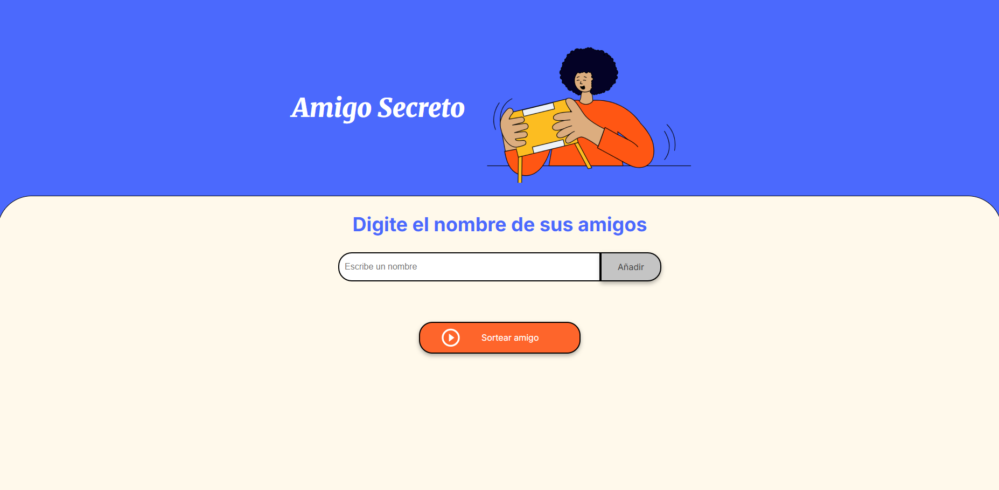

<h1 align="center"> 🎁 Challenge Amigo Secreto </h1>

---

    
---

## 📌 Descripción del Proyecto

Este proyecto fue desarrollado como parte del desafío **Challenge Amigo Secreto** del programa **Oracle Next Education (ONE) & Alura Latam**.

El reto entregaba una **base inicial** compuesta por:
- Un archivo **HTML** con la estructura y presentación del juego.
- Un archivo **CSS** con los estilos básicos.
- Un archivo **JavaScript vacío**, donde debía implementarse toda la lógica.

El objetivo del desafío es **practicar la lógica de programación** construyendo la funcionalidad de la aplicación. Para lograrlo, la aplicación debe cumplir con los siguientes requisitos:
1. Permitir que el usuario agregue nombres a través de un campo de texto y un botón **“Añadir”**.
2. Validar los datos de entrada: si el usuario intenta ingresar un nombre vacío, mostrar un **mensaje de alerta** Por favor, ingrese un nombre.
3. Realizar el sorteo: al hacer clic en **“Sortear Amigo”**, seleccionar **aleatoriamente** un nombre de la lista y mostrarlo en pantalla.

Durante el desarrollo se ponen en práctica **conceptos esenciales de lógica de programación**, entre ellos:

- **Variables** → almacenamiento y manipulación de datos.  
- **Condicionales** → validación de entradas y control de flujo.  
- **Funciones** → modularidad y reutilización de código.  
- **Listas (Arrays)** → gestión de los nombres y del sorteo.  
- **Manipulación del DOM** → actualización dinámica de la interfaz.  

Este desafío refuerza las bases necesarias para adaptarse a cualquier lenguaje de programación, fomentando soluciones más organizadas y mantenibles.

---

## 😃 Funcionalidades

- **Agregar participantes**: permite ingresar nombres mediante un campo de texto y el botón **“Añadir”**.  
- **Validación de duplicados**: evita que un nombre ya registrado se repita en la lista.  
- **Campo obligatorio**: impide agregar entradas vacías.  
- **Visualización dinámica**: muestra en tiempo real la lista de participantes ingresados.  
- **Sorteo aleatorio**: selecciona automáticamente un amigo secreto al presionar el botón **“Sortear Amigo”**.  
- **Mensaje de resultado**: despliega en pantalla el nombre sorteado.  
- **Sorteo sin repeticiones**: cada nombre solo puede ser seleccionado una vez durante la ronda.  
- **Mínimo de participantes**: requiere al menos **3 amigos** para realizar el sorteo.  
- **Reiniciar juego**: al finalizar todos los sorteos, se habilita el botón **“Nuevo Sorteo”**, que limpia la lista, los resultados y el estado general para comenzar de nuevo.
  
---

## 📌 Estado del proyecto

✅ Proyecto finalizado

---

## 🎥 Demostración

### 1. Agregar amigos
- Se pueden añadir nombres a la lista.
- **Campo vacío:** si el usuario intenta agregar un nombre vacío, aparece una alerta indicando que debe ingresar un valor.  

- **Nombre duplicado:** si el nombre ya fue agregado, se muestra una alerta de duplicado.  

### 2. Sorteo del amigo secreto
- **Sin participantes:** si no hay nombres en la lista, aparece una alerta indicando que primero deben agregarse amigos.  

- **Mínimo requerido:** para poder realizar el sorteo, deben existir al menos **3 participantes**; de lo contrario, se muestra una alerta.  

- **Sorteo aleatorio:** al hacer clic en **“Sortear”**, se selecciona un amigo al azar.  

- **Fin del sorteo:** si todos los amigos de la lista ya fueron sorteados, aparece una alerta indicando que es necesario iniciar un **nuevo sorteo**.  

---

## 🌐 Acceso al Proyecto

📂 Código fuente en GitHub:  
👉 [Repositorio en GitHub](https://github.com/Leidypv/Amigo-secreto)  

🚀 Versión desplegada:  
👉 [GitHub Pages](https://leidypv.github.io/Amigo-secreto/)  

---

## ⚙️ Instalación (opcional)

No necesitas instalar nada. 🎮
Solo abre la Versión online GitHub Pages en tu navegador y juega directamente.

Si quieres ejecutarlo de manera local:

1. Clona este repositorio.

2. Abre el archivo index.html en tu navegador.

---

## 🛠️ Tecnologías utilizadas  

- **JavaScript**  
    → Para la lógica de programación (arrays, funciones, validaciones, sorteo aleatorio).

- **HTML5**  
    → Para la estructura de la aplicación.

- **CSS3**  
    → Para los estilos básicos de la interfaz. 

- **StackBlitz**  
    → Como entorno de desarrollo en línea.

- **GitHub**  
     → Para el control de versiones y publicación del repositorio.

---

## 🎨 Modificaciones Realizadas  

Aunque el proyecto corresponde a un desafío académico, se incorporaron mejoras y personalizaciones para optimizar la experiencia:  

### 🎨 Interfaz y estilo  
- ✅ Pequeñas modificaciones en el archivo **CSS** para mejorar la presentación.  
- ✅ Cambio en la **imagen principal (.png)** para darle un estilo propio.  
- ✅ Inclusión de un **cursor parpadeante** en el campo de texto para mayor dinamismo visual.  

### 👥 Gestión de participantes  
- ✅ Validación para que **no se puedan ingresar nombres duplicados**.  

### 🎲 Lógica del sorteo  
- ✅ Validación para que el sorteo solo se ejecute si **hay al menos 3 amigos registrados**.  
- ✅ Control de sorteos para **evitar que un mismo nombre sea seleccionado más de una vez**.  
- ✅ Verificación de que **existan amigos disponibles** antes de cada sorteo.  
- ✅ Implementación de un botón **“Nuevo Sorteo”** que reinicia el juego por completo (lista de participantes, resultados y estado). 
 
---

## 🤝 Personas Contribuyentes  

- **Oracle Next Education (ONE) & Alura Latam** → Diseño y planteamiento del desafío académico.  
- **Docentes** → Guía en lógica de programación.  

---

## 👩‍💻 Personas Desarrolladoras del Proyecto  

- **Leidy Parrado** → Desarrollo y personalización del proyecto.  

---

## 📄 Licencia  

Este proyecto es de uso académico. No cuenta con una licencia específica de distribución.  
